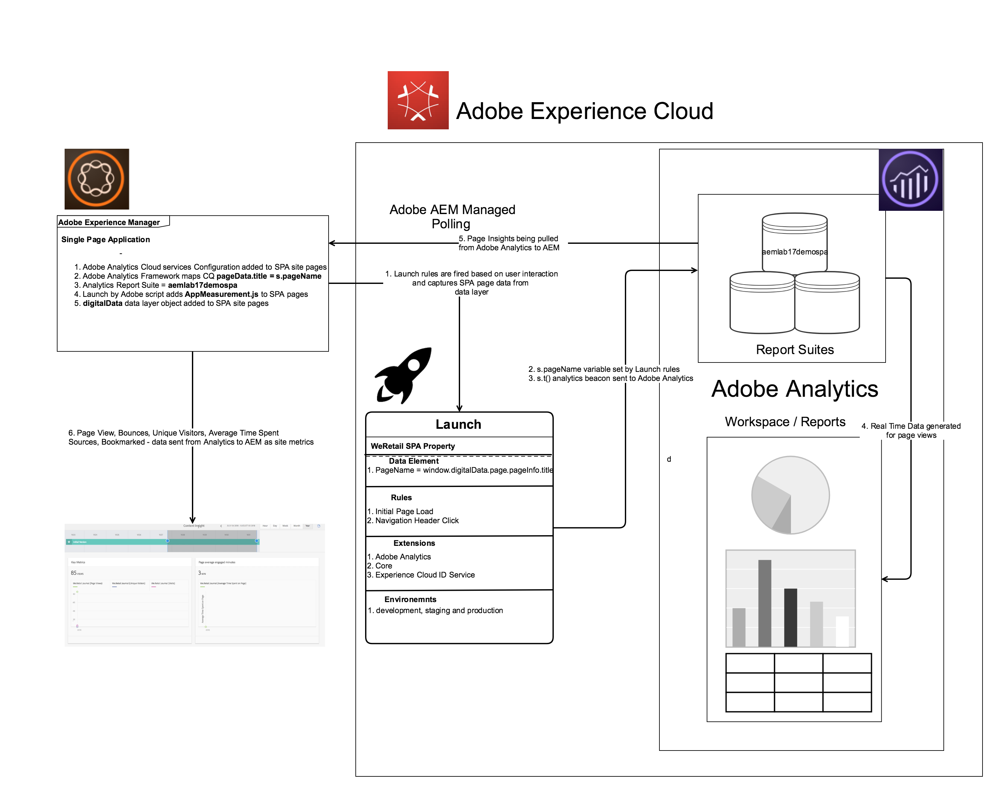

# Understanding Single Page Application Content Insights using Launch by Adobe{#understanding-single-page-application-content-insights-using-launch-by-adobe}

>[!NOTE]
>
>Caution:
>
>The Single-Page Application (SPA) Editor feature was introduced with AEM 6.4 and is currently a technology preview. The SPA Editor will be delivered separately to the AEM quickstart in an upcoming service pack for AEM 6.3 and 6.4.
>
>* This feature is still in development and documentation is subject to change.
>* The SPA Editor is the recommended solution for projects that require SPA framework based client-side rendering (e.g. React).
>* The SPA Editor Feature Pack is currently only available through the SPA Editor Beta Program. >
>    * Members of the SPA Editor Beta program can access the Feature Pack via Adobe's Prerelease website &gt; My Programs.
>
>*Note that while this video uses React as the example, the same paradigms apply to AEM's SPA Editor JavaScript SDK for Angular 6+.*

## Recommended reading {#recommended-reading}

*This video series assumes a basic understanding of both React and the AEM SPA Editor.*

The following resources are recommended for review prior to watching this video series:

* [SPA walkthrough](https://helpx.adobe.com/experience-manager/6-4/sites/developing/using/spa-walkthrough.html) - Overview of single page applications in general.
* [SPA Editor feature video](https://helpx.adobe.com/experience-manager/kt/sites/using/spa-editor-framework-feature-video-use.html) - Video overview of the SPA Editor and We.Retail Journal app.
* [React.js tutorial](https://reactjs.org/tutorial/tutorial.html) - An introduction to developing with the React framework.

## WeRetail Journal React Single Page Application (SPA) {#weretail-journal-react-single-page-application-spa}

>[!VIDEO](https://video.tv.adobe.com/v/23224/?quality=9)

*WeRetail Journal React Single Page Application and Launch By Adobe*

WeRetail recently launched a journal app to discuss some of their travel activities and they would like to analyze the user engagement on their home page. Content Insight provides information about page performance using web analytics and SEO recommendations. Use Content Insight to make decisions about how to modify pages, or to learn how previous changes have changed performance. For every page that you author, you can open Content Insight to analyse the page.

## Adding Launch By Adobe to AEM Single Page Applications {#adding-launch-by-adobe-to-aem-single-page-applications}

AEM 6.4 offers an out of the box integration between AEM 6.4 and Adobe Launch, which allows AEM administrators to easily configure AEM 6.4 and Adobe Launch via an easy to use interface, which reduces the level of effort and the number of errors when configuring these two tools.

* Read - [Integrate AEM with Adobe Launch Via Adobe I/O](https://helpx.adobe.com/experience-manager/using/aem_launch_adobeio_integration.html)
* Watch - [Integrating Launch by Adobe with Adobe Experience Manager](https://helpx.adobe.com/experience-manager/kt/integration/using/aem-launch-integration-tutorial-understand.html#aem-dtm)

## Adding Adobe Analytics Framework to Single Page Applications {#adding-adobe-analytics-framework-to-single-page-applications}

>[!VIDEO](https://video.tv.adobe.com/v/23225/?quality=9)

*Part2 - Adding Adobe Analytics Configuration and Framework to Single Page Application*

To track web data from your AEM pages in Adobe Analytics, create a Adobe Analytics Cloud Services configuration and a Adobe Analytics framework:

* **Adobe Analytics Configuration**: The information about your Adobe Analytics account. The Adobe Analytics configuration enables AEM to connect to Adobe Analytics. Create an Adobe Analytics configuration for each account that you use.
* **Adobe Analytics Framework**: A set of mappings between Adobe Analytics report suite properties and CQ variables. Use a framework to configure how your website data populates your Adobe Analytics reports. Frameworks are associated with a Adobe Analytics configuration. You can create multiple frameworks for each configuration.

The above video show how to create an Adobe Analytics Configuraion and Framework for your Single Page Application. Important point to note here is that, required Analytics scripts are not added to the SPA site pages by this configuration directly and instead it is loaded to the page by using a Tag Manager.

* [Integrating Adobe Analytics with Adobe Experience Manager](https://helpx.adobe.com/experience-manager/6-4/sites/administering/using/adobeanalytics.html)

## Launch Web Property for Single Page Application {#launch-web-property-for-single-page-application}

>[!VIDEO](https://video.tv.adobe.com/v/23226/?quality=9)

*Part3 - Launch By Adobe and Single Page Application Web Property configuration.*

**Browser Extensions**

* [**Adobe Experience Cloud Debugger Extension**](https://marketing.adobe.com/resources/help/en_US/experience-cloud-debugger/) - The Adobe Experience Cloud Debugger extension for Chrome examines your web pages and helps you find problems with how your Experience Cloud solutions are implemented.
* ** [Launch and DTM Switch](https://www.searchdiscovery.com/solutions/partners/adobe/adobe-launch/launch-dtm-switch/)** is a Chrome browser extension for users of Adobe Dynamic Tag Management (DTM) and/or Launch, by Adobe

```
// Details about last build and environment
_satellite.buildInfo

// Getting a data element value
_satellite.getVar("PageName");

// Accessing page info from digital data layer object
window.digitalData.page.pageInfo.title

//Analytics Page Name Variable
s.pageName

```

## Adobe Analytics WorkSpace and Real Time Reports {#adobe-analytics-workspace-and-real-time-reports}

>[!VIDEO](https://video.tv.adobe.com/v/23227/?quality=9)

*Part4 - Adobe Analytics Report Suite, WorkSpace and Real Time Reports*

[Real Time Report](https://marketing.adobe.com/resources/help/en_US/reference/realtime.html) - Displays web page traffic and ranks page views in real time. Provides actionable data to base your business decisions on.

[Analysis Workspace](https://marketing.adobe.com/resources/help/en_US/analytics/analysis-workspace/) - Analysis Workspace removes all of the typical limitations of a single Analytics report. It provides a robust, flexible canvas for building custom analysis projects. Drag-and-drop any number of data tables, visualizations, and components (dimensions, metrics, segments, and time granularities) to a project. Instantly create breakdowns and segments, create cohorts for analysis, create alerts, compare segments, do flow and fallout analysis, and curate and schedule reports for sharing with anyone in your business.

>[!NOTE]
>
>The Real-Time Report requires no additional implementation or tagging. It leverages your existing implementation of Adobe Analytics. To configure real-time reports, see [Real-Time Reports Configuration](https://marketing.adobe.com/resources/help/en_US/reference/t_realtime_admin.html#task_1CD03E9B6BDB48B08E9E612183557F40)

## Configuring Content Insights for Single Page Application {#configuring-content-insights-for-single-page-application}

>[!VIDEO](https://video.tv.adobe.com/v/23228/?quality=9)

*AEM Managed Polling Configuration and Content Insights*

Content Insight provides information about page performance using web analytics and SEO recommendations. Use Content Insight to make decisions about how to modify pages, or to learn how previous changes have changed performance. For every page that you author, you can open Content Insight to analyse the page.

### Configuring the Import Interval {#configuring-the-import-interval}

Configure the appropriate instance of the Adobe AEM Managed Polling Configuration service:

* Poll Interval:  
  The interval, in seconds, at which the service retrieves page view data from Adobe Analytics.  
  The default interval is 43200000 ms (12 hours).

* Enable:  
  Enable or disable the service. By default, the service is enabled.

To configure this OSGi service, you can either use the [Web Console](https://helpx.adobe.com/experience-manager/6-4/sites/deploying/using/configuring-osgi.html#main-pars_title_104) or an [osgiConfig node in the repository](https://helpx.adobe.com/experience-manager/6-4/sites/deploying/using/configuring-osgi.html#main-pars_par11) (the service PID is com.day.cq.polling.importer.impl.ManagedPollConfigImpl).

 

## Overview {#overview}

 
>[!MORE_LIKE_THIS]
>
>* [Getting Started with the AEM SPA Editor - Hello World Tutorial](https://helpx.adobe.com/experience-manager/kt/sites/using/spa-editor-helloworld-tutorial-use.html)
>* [Understanding SPA components in AEM SPA Editor](https://helpx.adobe.com/experience-manager/kt/sites/using/spa-editor-components-technical-video-understand.html)
>* [Understanding Single Page Application Content Insights using Launch by Adobe](https://helpx.adobe.com/experience-manager/kt/integration/using/aem-analytics-spa-tutorial-understand.html)
