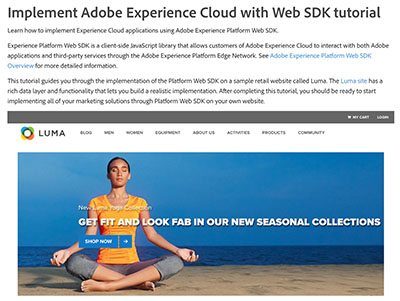
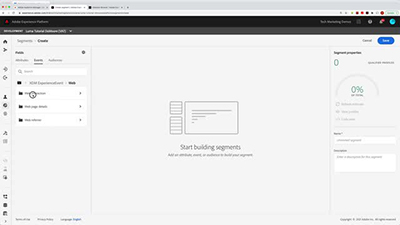
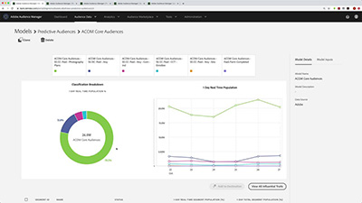

# Audience Manager tutorials

Welcome to the Audience Manager tutorials site. Using these tutorials along with the [documentation](https://experienceleague.adobe.com/docs/audience-manager/user-guide/aam-home.html) will give you a better understanding how to use Adobe Audience Manager to create and activate audiences on any channel or device using Adobe's best-in-class [!DNL data management platform].

* See the **"What's New"** section below for the latest updates and features
* **Staff Picks** highlights some of our favorite content
* Explore the content by topic and subtopic in the **left navigation**
* Use the **search** field at the top of the page if you know what you are looking for

## Staff picks

<table>
<tr>
  <td>
    
    

      <a href="https://experienceleague.adobe.com/docs/platform-learn/implement-web-sdk/overview.html">
    <strong>Implement Adobe Experience Cloud with Web SDK tutorial</strong>
    </a>
    

    

    <em>Learn how to implement Experience Cloud applications using Adobe Experience Platform Web SDK.</em>
    

  </td>
  <td>
    
    

      <a href="https://experienceleague.adobe.com/docs/audience-manager-learn/tutorials/other-integrations/integrating-with-rtcdp/rtcdp-segments-for-aam-users.html">
    <strong>Understanding Segments in Real-time CDP for Audience Manager Users</strong>
    </a>
    

    

    <em>This video looks at the differences in segments and segment creation between Audience Manager and Real-time CDP.</em>
    

  </td>
  <td>
    
    

      <a href="https://experienceleague.adobe.com/docs/audience-manager-learn/tutorials/build-and-manage-audiences/algorithmic-models/configure-and-report-on-predictive-audiences.html">
    <strong>Configure and report on Predictive Audiences in Audience Manager</strong>
    </a>
    

    

    <em>In this video, we will walk through Predictive Audiences configuration in the Audience Manager interface.</em>
    

  </td>
</tr>
</table>

