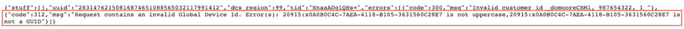
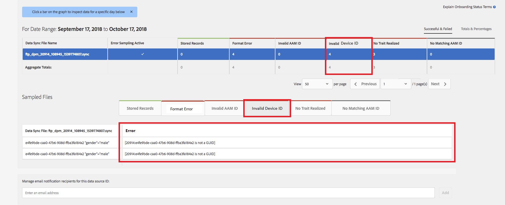

# Global Device ID Validation {#global-device-id-validation}

Device Advertising Identifiers (i.e. iDFA, GAID, Roku ID) have formatting standards that must be met in order to be usable in the digital advertising ecosystem. Today, customers and partners can upload IDs to our Global [!UICONTROL data sources] in any format without being notified of whether the ID is properly formatted. This feature will introduce validation of device IDs sent to the Global [!UICONTROL data sources] for proper formatting and will provide error messaging when IDs are incorrectly formatted. We will support validation for [!DNL iDFA], [!DNL Google Advertising] and [!DNL Roku IDs] at launch.

## Overview of Format Standards {#overview-of-format-standards}

The following are the global Device Advertising ID pools that are currently recognized and supported by AAM. These are implemented as shared [!UICONTROL Data Sources] that can be used by any customer or data partner that works with data tied to users of these platforms.

<table>
  <tr>
   <td>Platform </td>
   <td>AAM Data Source ID </td>
   <td>ID Format </td>
   <td>AAM PID </td>
   <td>Notes </td>
  </tr>
  <tr>
   <td>Google Android (GAID)</td>
   <td>20914</td>
   <td>32 hex numbers, generally presented as 8-4-4-4-12<em>example, 97987bca-ae59-4c7d-94ba-ee4f19ab8c21  </em> </td>
   <td>1352</td>
   <td>This ID must be collected in a raw/unhashed/unaltered form Reference - <a href="https://play.google.com/about/monetization-ads/ads/ad-id/">https://play.google.com/about/monetization-ads/ads/ad-id/</a></td>
  </tr>
  <tr>
   <td>Apple iOS (IDFA)</td>
   <td>20915</td>
   <td>32 hex numbers, generally presented as 8-4-4-4-12 <em>example, 6D92078A-8246-4BA4-AE5B-76104861E7DC  </em> </td>
   <td>3560</td>
   <td>This ID must be collected in a raw/unhashed/unaltered form Reference - <a href="https://support.apple.com/en-us/HT205223">https://support.apple.com/en-us/HT205223</a></td>
  </tr>
  <tr>
   <td>Roku (RIDA)</td>
   <td>121963</td>
   <td>32 hex numbers, generally presented as 8-4-4-4-12 <em>example,</em> <em>fcb2a29c-315a-5e6b-bcfd-d889ba19aada</em></td>
   <td>11536</td>
   <td>This ID must be collected in a raw/unhashed/unaltered form Reference - <a href="https://sdkdocs.roku.com/display/sdkdoc/Roku+Advertising+Framework">https://sdkdocs.roku.com/display/sdkdoc/Roku+Advertising+Framework</a> </td>
  </tr>
  <tr>
   <td>Microsoft Advertising ID (MAID)</td>
   <td>389146</td>
   <td>Alpha numeric string</td>
   <td>14593</td>
   <td>This ID must be collected in a raw/unhashed/unaltered form Reference - <a href="https://docs.microsoft.com/en-us/uwp/api/windows.system.userprofile.advertisingmanager.advertisingid">https://docs.microsoft.com/en-us/uwp/api/windows.system.userprofile.advertisingmanager.advertisingid</a> <a href="https://msdn.microsoft.com/en-us/library/windows/apps/windows.system.userprofile.advertisingmanager.advertisingid.aspx">https://msdn.microsoft.com/en-us/library/windows/apps/windows.system.userprofile.advertisingmanager.advertisingid.aspx</a></td>
  </tr>
  <tr>
   <td>Samsung DUID</td>
   <td>404660</td>
   <td>Alpha numeric string example, 7XCBNROQJQPYW</td>
   <td>15950</td>
   <td>This ID must be collected in a raw/unhashed/unaltered form Reference - <a href="https://developer.samsung.com/tv/develop/api-references/samsung-product-api-references/productinfo-api">https://developer.samsung.com/tv/develop/api-references/samsung-product-api-references/productinfo-api</a> </td>
  </tr>
</table>

## Setting an Advertising Identifier in the App {#setting-an-advertising-identifier-in-the-app}

Setting the advertiser ID in the app is really a two step process, first retrieving the advertiser ID, and then sending it to the Experience Cloud. Links are found below for performing these steps.

1. Retrieve the ID
    1. [!DNL Apple] information about the [!DNL advertising ID] can be found [HERE](https://developer.apple.com/documentation/adsupport/asidentifiermanager).
    1. Some information about setting the [!DNL advertiser ID] for [!DNL Android] developers can be found [HERE](http://www.androiddocs.com/google/play-services/id.html).
1. Send it into the Experience Cloud using the [!DNL setAdvertisingIdentifier] method in the SDK
    1. Information for using `setAdvertisingIdentifier` is in the [documentation](https://aep-sdks.gitbook.io/docs/using-mobile-extensions/mobile-core/identity/identity-api-reference#set-an-advertising-identifier) for both [!DNL iOS] and [!DNL Android].

`// iOS (Swift) example for using setAdvertisingIdentifier:`
`ACPCore.setAdvertisingIdentifier([AdvertisingId]) // ...where [AdvertisingId] is replaced by the actual advertising ID`

## DCS Error Messaging for Incorrect IDs  {#dcs-error-messaging-for-incorrect-ids}

When an incorrect Global Device ID (IDFA, GAID, etc) is submitted in realtime to Audience Manager, an error code will be returned on the hit. Following is an example of an error returned because the ID is sent in as an [!DNL Apple IDFA], which should only contain upper case letters, and yet there is a lower case 'x' in the ID.

Please see the [documentation](https://experienceleague.adobe.com/docs/audience-manager/user-guide/api-and-sdk-code/dcs/dcs-api-reference/dcs-error-codes.html?lang=en#api-and-sdk-code) for the list of error codes.

## Onboarding Global Device IDs {#onboarding-global-device-ids}

In addition to realtime submission of Global Device IDs, you are also able to "[!DNL onboard]" (upload) data against the IDs as well. This process is the same as when you are onboarding data against your customer IDs (typically via key/value pairs), but you would simply use the proper Data Source IDs, so that the data is assigned to the global device ID. Documentation about the onboarding process can be found in the [documentation](https://experienceleague.adobe.com/docs/audience-manager/user-guide/implementation-integration-guides/sending-audience-data/batch-data-transfer-process/batch-data-transfer-overview.html?lang=en#implementation-integration-guides). Just remember to use the global [!UICONTROL data source] ID, depending on the platform that you are using.

If incorrect Global Device IDs are submitted through the onboarding process, the errors will show in the [[!DNL Onboarding Status Report]](https://experienceleague.adobe.com/docs/audience-manager/user-guide/reporting/onboarding-status-report.html?lang=en#reporting).

Following is a sample of an error that would come through that report:

