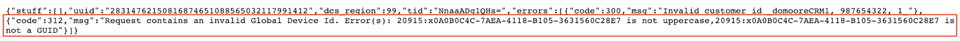

# Global Device ID Validation{#global-device-id-validation}

## Overview of Format Standards {#overview-of-format-standards}

The following are the global Device Advertising ID pools that are currently recognized and supported by AAM. These are implemented as shared Data Sources that can be used by any customer or data partner that works with data tied to users of these platforms.

<table border="1" cellpadding="1" cellspacing="0" width="100%"> 
 <tbody> 
  <tr> 
   <td><h3>Platform</h3> </td> 
   <td><h3>AAM Data Source ID</h3> </td> 
   <td><h3>ID Format</h3> </td> 
   <td><h3>AAM PID</h3> </td> 
   <td><h3>Notes</h3> </td> 
  </tr> 
  <tr> 
   <td>Google Android (GAID)</td> 
   <td>20914</td> 
   <td><p>32 hex numbers, generally presented as 8-4-4-4-12</p> <p><em>example, 97987bca-ae59-4c7d-94ba-ee4f19ab8c21<br /> </em></p> </td> 
   <td>1352</td> 
   <td><p>This ID must be collected in a raw/unhashed/unaltered form</p> <p>Reference - <a href="https://play.google.com/about/monetization">https://play.google.com/about/monetization</a>-ads/ads/ad-id/</p> </td> 
  </tr> 
  <tr> 
   <td>Apple iOS (IDFA)</td> 
   <td>20915</td> 
   <td><p>32 hex numbers, generally presented as 8-4-4-4-12</p> <p><em>example, 6D92078A-8246-4BA4-AE5B-76104861E7DC<br /> </em></p> </td> 
   <td>3560</td> 
   <td><p>This ID must be collected in a raw/unhashed/unaltered form</p> <p>Reference - <a href="https://support.apple.com/en">https://support.apple.com/en</a>-us/HT205223</p> </td> 
  </tr> 
  <tr> 
   <td>Roku (RIDA)</td> 
   <td>121963</td> 
   <td><p>32 hex numbers, generally presented as 8-4-4-4-12</p> <em>example,</em> <em>fcb2a29c-315a-5e6b-bcfd-d889ba19aada</em></td> 
   <td>11536</td> 
   <td><p>This ID must be collected in a raw/unhashed/unaltered form</p> <p>Reference - <a href="https://sdkdocs.roku.com/display/sdkdoc/Roku+Advertising+Framework">https://sdkdocs.roku.com/display/sdkdoc/Roku+Advertising+Framework</a></p> </td> 
  </tr> 
  <tr> 
   <td>Microsoft Advertising ID (MAID)</td> 
   <td>389146</td> 
   <td>Alpha numeric string</td> 
   <td>14593</td> 
   <td><p>This ID must be collected in a raw/unhashed/unaltered form</p> <p>Reference - <a href="https://docs.microsoft.com/en-us/uwp/api/windows.system.userprofile.advertisingmanager.advertisingid">https://docs.microsoft.com/en-us/uwp/api/windows.system.userprofile.advertisingmanager.advertisingid</a></p> <p>https://msdn.microsoft.com/en-us/library/windows/apps/windows.system.userprofile.advertisingmanager.advertisingid.aspx</p> <p> </p> </td> 
  </tr> 
  <tr> 
   <td><p>Samsung DUID</p> </td> 
   <td>404660</td> 
   <td><p>Alpha numeric string</p> <p>example, 7XCBNROQJQPYW</p> </td> 
   <td>15950</td> 
   <td><p>This ID must be collected in a raw/unhashed/unaltered form</p> <p>Reference - <a href="https://developer.samsung.com/tv/develop/api-references/samsung-product-api-references/productinfo-api">https://developer.samsung.com/tv/develop/api-references/samsung-product-api-references/productinfo-api</a></p> </td> 
  </tr> 
 </tbody> 
</table>

## Setting an Advertising Identifier in the App {#setting-an-advertising-identifier-in-the-app}

Setting the advertiser ID in the app is really a two step process, first retrieving the advertiser ID, and then sending it to the Experience Cloud. Links are found below for performing these steps.

1. Retrieve the ID

    1. Apple information about the advertising ID can be found [HERE](https://developer.apple.com/documentation/adsupport/asidentifiermanager).
    1. Some information about setting the advertiser ID for Android developers can be found [HERE](http://www.androiddocs.com/google/play-services/id.html).

1. Send it into the Experience Cloud using the setAdvertisingIdentifier method in the SDK

    1. Documentation for using "setAdvertisingIdentifier" is in the documentation [HERE](https://aep-sdks.gitbook.io/docs/using-mobile-extensions/mobile-core/identity/identity-api-reference#set-an-advertising-identifier) for both iOS and Android.

```
// iOS (Swift) example for using setAdvertisingIdentifier:

ACPCore.setAdvertisingIdentifier([AdvertisingId]) // ...where [AdvertisingId] is replaced by the actual advertising ID
```

## DCS Error Messaging for Incorrect IDs  {#dcs-error-messaging-for-incorrect-ids}

When an incorrect Global Device ID (IDFA, GAID, etc) is submitted in realtime to Audience Manager, an error code will be returned on the hit. Following is an example of an error returned because the ID is sent in as an Apple IDFA, which should only contain upper case letters, and yet there is a lower case 'x' in the ID.



Please see [the documentation](https://marketing.adobe.com/resources/help/en_US/aam/dcs_error_codes.html) for the list of error codes.

## Onboarding Global Device IDs {#onboarding-global-device-ids}

In addition to realtime submission of Global Device IDs, you are also able to "onboard" (upload) data against the IDs as well. This process is the same as when you are onboarding data against your customer IDs (typicaly via key/value pairs), but you would simply use the proper Data Source IDs, so that the data is assigned to the global device ID. Documentation about the onboarding process can be found in the documentation [HERE](https://marketing.adobe.com/resources/help/en_US/aam/c_inbound_async_intro.html). Just remember to use the global data source ID, depending on the platform that you are using.

If incorrect Global Device IDs are submitted through the onboarding process, the errors will show in the [Onboarding Status Report](https://marketing.adobe.com/resources/help/en_US/aam/onboarding-status-report.html).

Following is a sample of an error that would come through that report:


